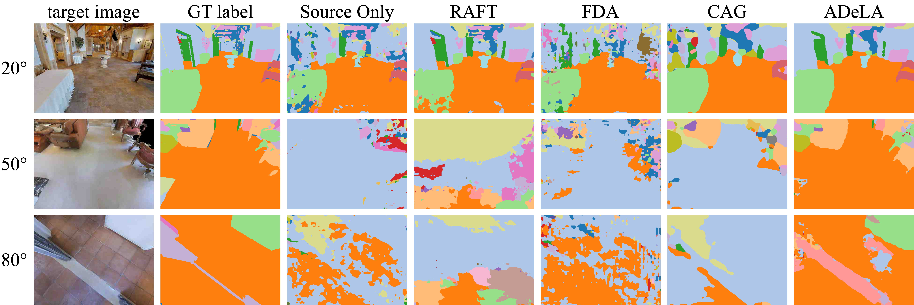
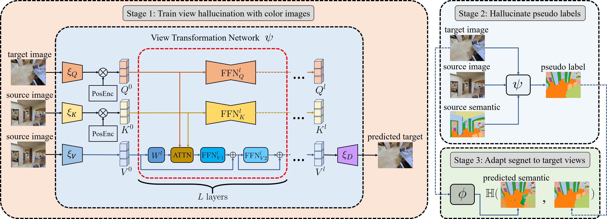

# ADeLA: Automatic Dense Labeling with Attention for Viewpoint Shift in Semantic Segmentation 

## Introduction

This is the official implementation of our [ADeLA](https://openaccess.thecvf.com/content/CVPR2022/html/Ren_ADeLA_Automatic_Dense_Labeling_With_Attention_for_Viewpoint_Shift_in_CVPR_2022_paper.html) paper for CVPR 2022

We describe a method to deal with performance drop in semantic segmentation caused by viewpoint changes within multi-camera systems, where temporally paired images are readily available, but the annotations may only be abundant for a few typical views. Our method utilizes a novel attention-based view transformation network trained only on color images to hallucinate the semantic images for the target. Despite the lack of supervision, the view transformation network can still generalize to semantic images

Below shows a comparison of our method and other top-performing methods in transferring labels from source view to target views.



## Usage

### Installation

```
conda create -n adela python=3.8.5 -y
conda activate adela
conda install pytorch=1.8.1 torchvision=0.9.1 cudatoolkit=11.1 cudnn -c pytorch -c conda-forge
conda install habitat-sim=0.2.1 -c conda-forge -c aihabitat
pip install -r requirements.txt
```

### Data and model weight preparation

#### Data

Our dataset can be downloaded [here](https://drive.google.com/file/d/1Rv_-gecVdhMSk_hhe9Ulq1cw5rD5vCG1/view?usp=sharing). Please unarchive and put it under the `./data` folder

#### Model weight

The trained ADeLA weight can be found [here](https://drive.google.com/file/d/1hoBPGHJCjbNnWQoEq4cyRWWWmAd1QRcx/view?usp=sharing). The initialization weight for the DeepLab training can be downloaded [here](http://vllab.ucmerced.edu/ytsai/CVPR18/DeepLab_resnet_pretrained_init-f81d91e8.pth).

Please download and put these two checkpoints in the `./ckpt` folder.

### Demo

run `sh ./scripts/demo.sh` to see a sample of hallucinated labels, you can also modify contents in `./scripts/demo.txt`and `target_angle` parameter in `demo.sh` to see other results.

After running the demo script, checkout results at `./logs/ADeLA/demo/results` 

### Steps to reproduce the results



As described in our paper, the whole pipeline contains 3 steps.

#### 1. Train the View Transformation Network

  `sh ./scripts/stage1.sh`

#### 2. Hallucinate pseudo labels

` sh ./scripts/stage2.sh`

Note this step might take as long as 150 hours for a single GPU machine to hallucinate all 10~90 target view labels.

The hallucinated soft labels are too big to share (around 45GB). The hallucinated hard labels can be found [here](https://drive.google.com/file/d/1DXH-QKnofzkooPRm8kmRFAtkhmq8kejp/view?usp=sharing).

#### 3. Adapt the Segmentation network from source view to target views

`sh ./sripts/stage3.sh $angle` where `$angle` is the desired target view angle. E.g. `sh ./scripts/stage3.sh 30`  adapts segnet from 0° to 30°

### Citation

if you find our work helpful please consider citing
```
@InProceedings{ren2022adela,
    author    = {Ren, Hanxiang and Yang, Yanchao and Wang, He and Shen, Bokui and Fan, Qingnan and Zheng, Youyi and Liu, C. Karen and Guibas, Leonidas J.},
    title     = {ADeLA: Automatic Dense Labeling With Attention for Viewpoint Shift in Semantic Segmentation},
    booktitle = {Proceedings of the IEEE/CVF Conference on Computer Vision and Pattern Recognition (CVPR)},
    month     = {June},
    year      = {2022},
    pages     = {8079-8089}
}
```

### Misc

Deeplab code borrowed from [AdaptSegNet](https://github.com/wasidennis/AdaptSegNet)

Part of the ADeLA structure is inspired by [STTN](https://github.com/researchmm/STTN)

